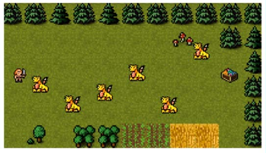

# Create a Road Crossing Game with Phaser 3

Este repositório contém os arquivos referentes ao projeto desenvolvido durante a formação ministrada no curso **Phaser Mini-Degree**, oferecido pela [Zenva Academy](https://academy.zenva.com/).

O objetivo desse projeto é explorar os fundamentos do desenvolvimento de jogos e da biblioteca Phaser, por meio do desenvolvimento de um jogo no estilo **Frogger**.

    
     
    <i>Zenva's Road Crossing Game</i>

Para ser redirecionado para a página do curso, [clique aqui](https://academy.zenva.com/course/create-a-road-crossing-game-with-phaser-3/)!